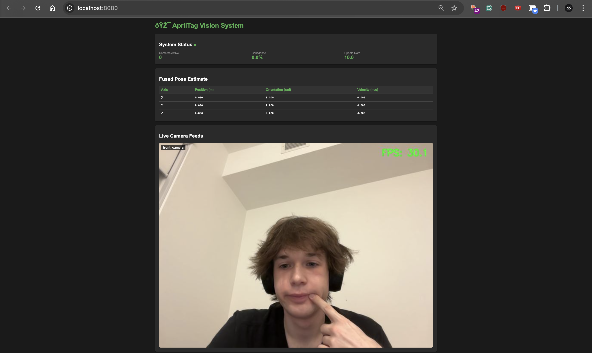
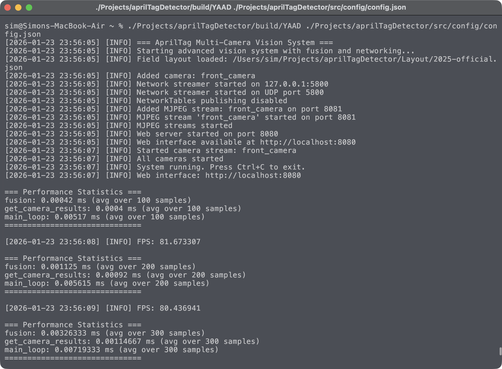
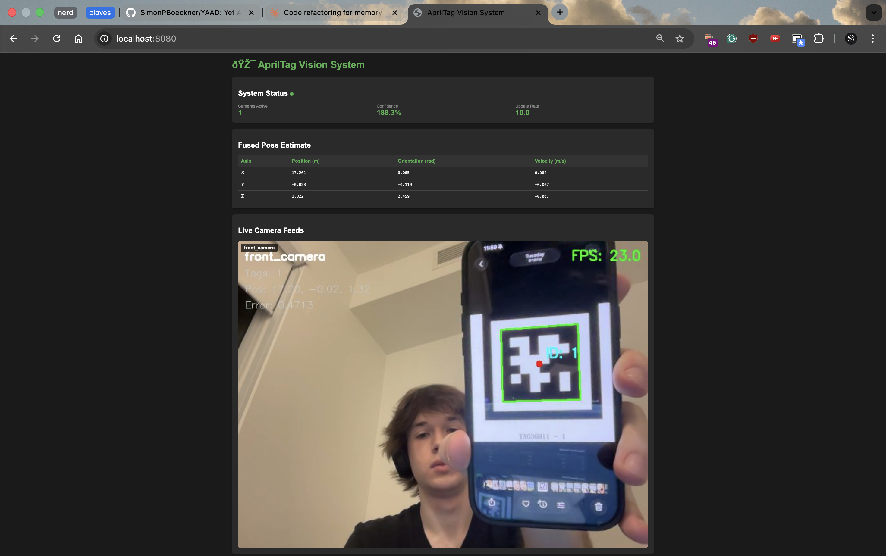

# YAAD – Yet Another AprilTag Detector

> An AprilTag detection and pose estimation pipeline written in **C++**, designed for robotics coprocessors.

---

## Demo & Screenshots

### Dashboard


### Terminal Output


### Detection Demo  


---

## Features

- AprilTag detection using the **AprilRobotics C library**
- OpenCV-based image capture and processing
- Matrix math done with **Eigen**
- Output results via **WPILib NetworkTables**
- Web-based dashboard
- JSON-based configuration system

---

## Dependencies

Everything listed below is required and referenced in `CMakeLists.txt`.

### Core Libraries

- **AprilTag (C library)**  
  https://github.com/AprilRobotics/apriltag

- **OpenCV (C++ + extra modules)**  
  https://opencv.org  
  https://github.com/opencv/opencv  
  https://github.com/opencv/opencv_contrib

- **WPILibC / NetworkTables**  
  https://github.com/wpilibsuite/allwpilib

- **Eigen (Linear Algebra)**  
  https://gitlab.com/libeigen/eigen

- **JSON for Modern C++**  
  https://github.com/nlohmann/json

If it’s mentioned in `CMakeLists.txt`, you probably need it installed.

---

## Building

```bash
- Building
git clone https://github.com/SimonPBoeckner/YAAD
cd YAAD
mkdir build && cd build
cmake ..
make
Notes
You must update library paths in CMake to match your system

- Running
./YAAD [path/to/config.json]
If no config path is provided, the default config is used

All camera, tag, dashboard, and network settings live in the config file

- Dashboard
Default URL:
http://localhost:8080
The port can be changed in the configuration file

- NetworkTables
Uses WPILib NetworkTables
The server IP should be set to the IP of the roboRIO or other main controller
Fully configurable via JSON

- Deployment Recommendations
Recommended operating systems for a coprocessor:
    - Ubuntu Server
    - Debian
    - Fedora Server

After initial setup:
SSH into the machine for development and maintenance
No desktop environment required

systemd service (Recommended)
It is strongly recommended to run YAAD as a systemd service so it:
Starts automatically on boot
Restarts if it crashes
Runs headless without manual intervention

Example Service File (Placeholder)
[Unit]
Description=YAAD AprilTag Detector
After=network.target

[Service]
ExecStart=/path/to/YAAD /path/to/config.json
Restart=always
User=your-user
WorkingDirectory=/path/to/YAAD

[Install]
WantedBy=multi-user.target

- Final Notes
This project assumes comfort with compiling C++ on Linux/MacOS (I made this on my macbook)

Configuration and tuning are expected

ignore the commit history I'm a little silly
```